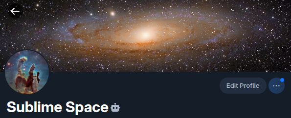

# Sublime Space Bot

A simple bluesky bot to post sublime pictures of our universe. Powers the [Sublime Space](https://bsky.app/profile/sublime-space.bsky.social) Bluesky account.

[](https://bsky.app/profile/sublime-space.bsky.social)

## License

This project is licensed under the AGPL-3.0-or-later License. See the [LICENSE.md](LICENSE.md) file for details.

## Features

- Posts NASA's Astronomy Picture of the Day to Bluesky
- Posts NASA EPIC Earth imagery weekly
- Posts NASA SDO solar imagery weekly
- Posts ESA/Hubble archive imagery weekly
- Posts new ESA/Webb Picture of the Month images when they appear
- Posts NSF NOIRLab Image of the Week imagery weekly
- Automatically compresses images to meet Bluesky's size limits
- Supports image APODs and video APODs with Bluesky link cards
- Includes alt text plus a source and credit reply for each post
- Adds `#Astronomy` and `#Space` to the main post for discovery

## Nasa's Astronomy Picture of the Day (APOD)

The `src/post-apod.ts` script:

1. fetches the APOD from `https://api.nasa.gov/planetary/apod`;
2. downloads the daily image when `media_type=image`;
3. compresses images below Bluesky's 1 MB limit;
4. publishes image APODs with the image and alt text;
5. publishes video APODs as Bluesky link cards with thumbnails when NASA provides one;
6. replies to the main post with the APOD source and credit.

If the daily APOD is a video, the bot does not re-upload the video file. It links to the original video source and uses NASA's thumbnail when available.

## NASA EPIC Earth imagery

The `src/post-epic.ts` script:

1. fetches the latest natural color Earth images from `https://api.nasa.gov/EPIC/api/natural`;
2. picks the latest available image;
3. downloads and compresses the image below Bluesky's 1 MB limit;
4. publishes the image with a short Earth-focused caption;
5. replies to the main post with NASA EPIC/DSCOVR credit and the source image URL.

## NASA SDO solar imagery

The `src/post-sdo.ts` script:

1. downloads the latest Solar Dynamics Observatory images from `https://sdo.gsfc.nasa.gov/assets/img/latest/`;
2. compresses images below Bluesky's 1 MB limit;
3. publishes a multi-image post with complementary solar views;
4. replies to the main post with NASA/SDO/AIA credit and the source URL.

## ESA/Hubble archive imagery

The `src/post-hubble.ts` script:

1. computes the ESA/Hubble Picture of the Week archive ID for the current week;
2. fetches image metadata from `https://esahubble.org/images/{imageId}/api/json/`;
3. downloads and compresses the image below Bluesky's 1 MB limit;
4. publishes the image with a short Hubble-focused caption;
5. replies to the main post with ESA/Hubble credit and the source URL.

The weekly rotation starts at `potw1101a`, advances by one archive image per week, and wraps back to the start after `potw2552a`.

## ESA/Webb Picture of the Month

The `src/post-webb.ts` script:

1. fetches the latest ESA/Webb Picture of the Month from `https://esawebb.org/images/potm/json/`;
2. fetches image metadata from `https://esawebb.org/images/{imageId}/api/json/`;
3. skips the run when that `imageId` has already been posted;
4. downloads and compresses the image below Bluesky's 1 MB limit;
5. publishes the image with a short Webb-focused caption;
6. replies to the main post with ESA/Webb credit and the source URL.

The duplicate guard is stored in `.bot-state.json`, which is ignored by git.

## NSF NOIRLab Image of the Week

The `src/post-noirlab.ts` script:

1. fetches the latest NSF NOIRLab Image of the Week from `https://noirlab.edu/public/images/iotw/feed/`;
2. reads the image, title, source, and publication date from the RSS item;
3. skips the run when that image has already been posted;
4. downloads and compresses the image below Bluesky's 1 MB limit;
5. publishes the image with a short NOIRLab-focused caption;
6. replies to the main post with NSF NOIRLab credit and the source URL.

## Local setup

Prerequisite: Node.js 24 or later with Corepack enabled.

On your server or local machine, clone this repo and run:

```bash
corepack enable
pnpm install
cp .env.example .env
```

Then create:

- a NASA API key at https://api.nasa.gov/;
- a Bluesky App Password in Settings -> Privacy and Security -> App Passwords.

Fill in `.env`, then test without posting:

```bash
pnpm dry-run:apod
pnpm dry-run:epic
pnpm dry-run:hubble
pnpm dry-run:noirlab
pnpm dry-run:sdo
pnpm dry-run:webb
```

Publish for real:

```bash
pnpm post:apod
pnpm post:epic
pnpm post:hubble
pnpm post:noirlab
pnpm post:sdo
pnpm post:webb
```

## Local cron

Install or update all cron jobs from the repository root:

```bash
pnpm install:cron
```

This preserves unrelated cron entries and replaces existing Sublime Space Bot entries.

All jobs run from the repository directory, retry up to 3 times with 1 hour between attempts, and append logs to `bot.log`.

## Operations

View installed cron jobs:

```bash
crontab -l
```

Follow bot logs:

```bash
tail -f bot.log
```
